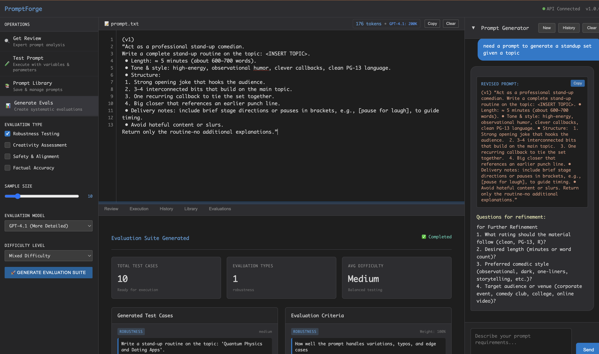

# PromptForge 🔨

**The AI prompt engineering workbench that generates, analyzes, and systematically tests prompts**

Stop writing prompts from scratch. Let AI help you craft better prompts, then systematically validate them.



## 🚀 Quick Start

**Option 1: Run with Node.js (Recommended for this demo)**
```bash
npm install
npm start
```

**Option 2: Docker (Original)**
```bash
docker run -d -p 8080:8080 -e ANTHROPIC_API_KEY="your-key" promptforge:latest
```

**Option 3: Clone and run original Go version**
```bash
git clone https://github.com/insaanimanav/promptforge.git
cd promptforge && ./start.sh
```

Open `http://localhost:8080` and start crafting better prompts.

## ✨ Features

### 🔍 Advanced Prompt Analysis
- **Quick Review**: Instant optimization suggestions
- **Deep Analysis**: Comprehensive prompt evaluation and scoring
- **Dual Analysis**: Both quick and detailed reports side-by-side

### 🧪 Systematic Testing
- Execute prompts with full parameter control
- Multi-model comparison (Claude, GPT-4, Azure OpenAI)
- Dynamic variable detection and substitution

### 📊 Evaluation Engine
- **Robustness Testing**: Edge cases, typos, variations
- **Safety Analysis**: Bias detection, harmful content resistance
- **Accuracy Verification**: Factual correctness checks
- **Creativity Assessment**: Novel thinking scenarios

### 📚 Prompt Management
- Organized library with search and tags
- Complete execution history
- Import/export capabilities

## 🔧 Configuration

Set environment variables for AI providers:

```bash
# Anthropic (Default)
export ANTHROPIC_API_KEY="sk-ant-api03-..."

# OpenAI  
export OPENAI_API_KEY="sk-..."

# Azure OpenAI
export AZURE_OPENAI_API_KEY="your-key"
export AZURE_OPENAI_BASE_URL="https://your-resource.openai.azure.com"
```

## 🤖 Supported Models

- **Claude 3.5 Sonnet** (200K context) - Excellent reasoning
- **GPT-4.1** (200K context) - Detailed analysis  
- **O3** (1M context) - Fast execution
- **Azure OpenAI** - Enterprise-ready

## 📡 API Endpoints

- `GET /api/health` - Health check
- `POST /api/critique` - Analyze prompts
- `POST /api/dual-critique` - Quick + detailed analysis
- `POST /api/execute` - Test prompts
- `POST /api/multi-model-execute` - Compare across models
- `POST /api/generate-eval` - Create test suites
- `GET /api/prompts` - Manage prompt library

## 🎯 Demo Mode

This deployment runs in demo mode with mock AI responses. To enable real AI functionality:

1. Add your API keys as environment variables
2. The application will automatically detect and use configured providers
3. Remove mock responses and integrate with actual AI APIs

## 🛠️ Development

```bash
# Install dependencies
npm install

# Start development server
npm run dev

# The server will restart automatically on file changes
```

## 📄 License

GPLv3 - Built with ❤️ for better AI interactions

---

**Transform prompt engineering from art to science**